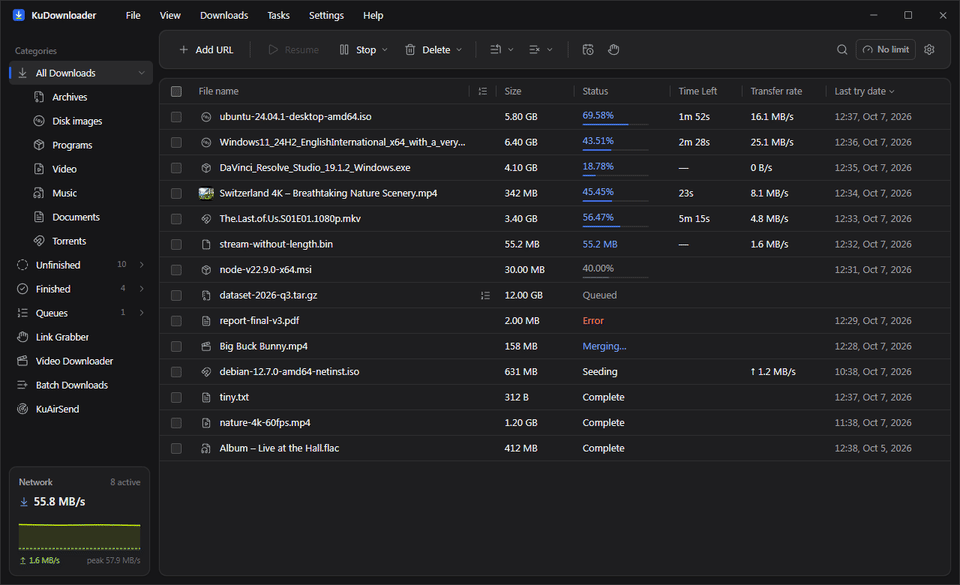
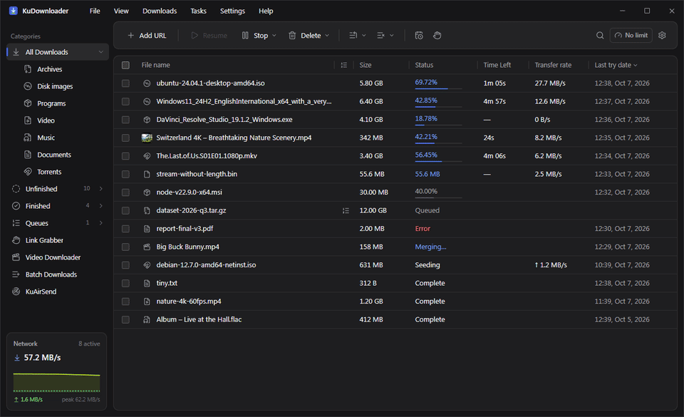
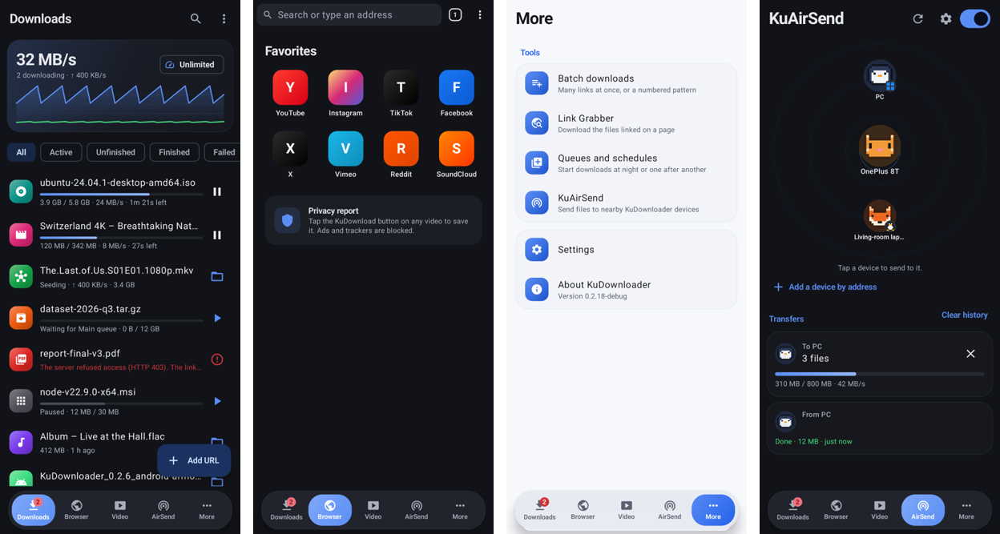
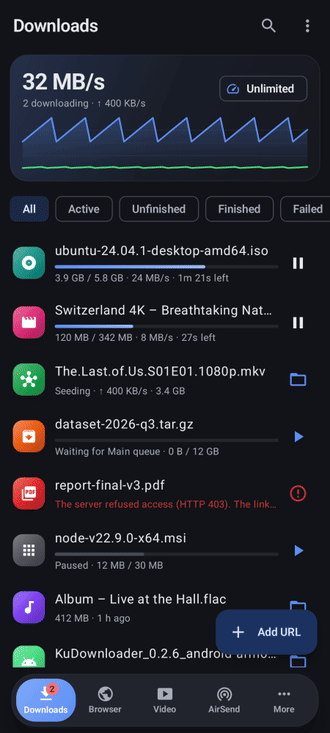

<div align="center">


# KuDownloader

**The fast, free download manager for Windows, macOS, Linux and Android.**
Files, videos from 1,000+ sites, torrents, and transfers between your own devices, all in one app.

[](https://github.com/kuduyDigital/ku-download-manager/releases/latest) [](https://github.com/kuduyDigital/ku-download-manager/releases) [](https://addons.mozilla.org/firefox/addon/kudownloader/) [](LICENSE) 

**[Download](https://github.com/kuduyDigital/ku-download-manager/releases/latest)** · **[Website](https://kuduydigital.github.io/ku-download-manager/)** · **[Documentation](https://kuduydigital.github.io/ku-download-manager/docs.html)** · **[Firefox add-on](https://addons.mozilla.org/firefox/addon/kudownloader/)**

<br>



</div>

## Why KuDownloader

- **Fast.** KuHTTP, its own adaptive engine, splits each file across many connections and rebalances them as they finish, so downloads use your full bandwidth.
- **Never starts over.** Pause, close the app, reboot or lose the network: downloads pick up where they stopped, and every resumed file is checked.
- **Videos and music from 1,000+ sites** in the quality you choose (up to 4K, MP3/M4A audio, playlists, subtitles), powered by yt-dlp.
- **Catches browser downloads.** The extension hands files and videos to KuDownloader, with a **KuDownload** button on video players.
- **Torrents and magnets**, plus FTP, SFTP and Metalink.
- **KuAirSend** moves files, folders, text and links between your computers and phones over your own Wi-Fi: encrypted, no cloud, no size limit.
- **Private by design.** No ads, no accounts, no tracking. Everything stays on your devices.

## Features

<table>
<tr>
<td width="50%" valign="top">

### Downloads
- Multi-connection engine with live segment map
- Queues, schedules and speed profiles
- Sleep, shut down or quit when done
- Duplicate detection, checksum verification
- Cloud links resolved to the real file (Google Drive, Dropbox, SourceForge, GitHub)
- Link Grabber: download every file linked on a page
- Batch downloads and numbered patterns
- Optional virus scan of finished files

</td>
<td width="50%" valign="top">

### Video and music
- 1,000+ sites: YouTube, Instagram, TikTok, X, Facebook, Vimeo…
- Pick the quality before downloading, or audio only
- Whole playlists and channels
- Subtitles and thumbnails embedded
- Copy a video's title or caption in one click
- Short, clean file names, even for long non-Latin titles
- DRM-protected media is detected and refused

</td>
</tr>
<tr>
<td valign="top">

### Browser integration
- Extension for Firefox ([Add-ons](https://addons.mozilla.org/firefox/addon/kudownloader/)), Chrome, Edge, Brave, Opera, Vivaldi
- Always-on-top **Download File** window for caught downloads
- **KuDownload** button on video players (iframes and fullscreen too)
- Right-click: download a link, or all links on a page

</td>
<td valign="top">

### Made to feel at home
- Native title bar on Windows, macOS, GNOME, KDE and tiling desktops
- Light and dark, accent colours, palettes from OLED black to Cyberpunk and the anime themes Sakura and Sora
- 12 languages, including Arabic (right to left)
- Progress on the taskbar icon, tray mode, desktop notifications

</td>
</tr>
</table>

<div align="center">

</div>

## KuDownloader for Android

The same engine on your phone, with a fast built-in browser:

- **Download any video you're watching:** tap the button on the page, pick a quality. Press and hold it to stream in your video player or send the video to your PC.
- **Ad and pop-up blocking:** pop-under tabs and ad redirects are stopped.
- **Browser tools:** private tabs, find in page, translate, text size, data saver, save as PDF, add to Home screen.
- **Background downloads** with Wi-Fi-only and battery-saver options.
- **KuAirSend** to and from your computers.

<div align="center">

<br><br>

</div>

## Download

| System | Package |
|---|---|
| **Windows** 10/11 x64 | `KuDownloader_<v>_x64-setup.exe` (per-user, no admin needed) |
| **macOS** 11+ *(beta)* | `KuDownloader_<v>_aarch64.dmg` (Apple silicon), `KuDownloader_<v>_x64.dmg` (Intel) |
| **Debian / Ubuntu** *(beta)* | `KuDownloader_<v>_amd64.deb`, `…_arm64.deb` |
| **Fedora / openSUSE** *(beta)* | `KuDownloader-<v>-1.x86_64.rpm`, `…aarch64.rpm` |
| **Arch** *(beta)* | `kudownloader-<v>-1-x86_64.pkg.tar.zst` (`pacman -U`) |
| **Android** 7+ | `KuDownloader_<v>_android-arm64-v8a.apk` (most phones), `…armeabi-v7a.apk`, `…x86_64.apk`, `…universal.apk` |

All from the [latest release](https://github.com/kuduyDigital/ku-download-manager/releases/latest). Installed copies update themselves.

**First launch:**
- **Windows:** SmartScreen may ask once; choose **More info → Run anyway**.
- **macOS:** right-click the app and choose **Open**.
- **Android:** allow installing from your browser or file manager.

yt-dlp and FFmpeg install themselves from their official releases, checked against the published checksums. aria2 comes with the Windows installer and as a dependency of the Linux packages.

**Verifying a download:** every release is signed and lists the SHA-256 of each file in `SHA256SUMS.txt`. See [SIGNING.md](SIGNING.md) for what is signed with what and how to check it.

## How it works

```
Browser ── KuDownloader extension ── Native Messaging ── ku-native-host
                                                              │ (local API, token)
ku CLI ──────────────────────────────────────────────────────┤
                                                              ▼
Desktop app (Tauri) ── IPC ──▶ KuCore ──┬─▶ aria2   HTTP(S) · FTP · SFTP · BitTorrent · magnet · Metalink
                                        ├─▶ yt-dlp  media sites · HLS/DASH (FFmpeg for merging)
                                        └─▶ KuHTTP  native adaptive HTTP engine (default for HTTP/HTTPS)
                                        │
                                        └── SQLite (state, queues, schedules, settings)
```

## Repository

| Path | What |
|---|---|
| `crates/kucore` | Engine: SQLite persistence, aria2 supervisor + JSON-RPC, yt-dlp runner, queue/scheduler, smart connections, retries, crash recovery, local API, native-host registration, power actions, **KuHTTP** (`src/kuhttp`) |
| `crates/ku-proto` | Shared types, paths, dependency-free loopback API client and app launcher |
| `crates/ku-native-host` | Native messaging host (whitelisted requests only) |
| `crates/ku-cli` | `ku` command-line tool |
| `app/` | Tauri 2 shell (`src-tauri`) and React UI (`src`, design tokens in `src/design-system`) |
| `extension/` | WebExtension (Chromium browsers, Firefox and forks): interception, context menus, media detection, hover button with site adapters; store listing kit in `extension/STORE.md` |
| `packaging/` | Arch `PKGBUILD` and Flatpak manifest (built from the .deb in CI) |
| `docs/site` | Project page and privacy policy (GitHub Pages) |
| `docs/benchmarks` | KuHTTP vs aria2 results |

## Build and run

Requirements: Rust (stable), Node 22+, pnpm, and on Windows the MSVC build
tools. `aria2c` on `PATH` for torrents/FTP (winget `aria2.aria2`, distro
packages, `brew install aria2`); yt-dlp and FFmpeg can be installed from the app.

```bash
cd app && pnpm install && pnpm tauri dev      # desktop app (dev)
cd extension && node build.mjs                # extension → extension/dist/{chrome,firefox}
cargo build --release -p ku-cli -p ku-native-host
```

**Browser Integration** in the app lists every installed browser — anything
registered with Windows (Chrome, Edge, Brave, Helium, Opera, Vivaldi, Zen,
Floorp, …) plus known install folders — and installs the extension per browser
or in all of them: it opens the browser's extensions page and copies the
extension folder path for *Load unpacked*. The native host is registered where
each browser actually reads it (e.g. `HKCU\Software\imput\Helium\NativeMessagingHosts`),
under the current user, at startup and before each install.

Chromium browsers on Windows refuse `.crx` files that don't come from their
web store (`CRX_REQUIRED_PROOF_MISSING`), so `kudmx.crx` is for store upload or
policy deployment; *Load unpacked* is the direct path. Firefox users install the
listed add-on from [Firefox Add-ons](https://addons.mozilla.org/firefox/addon/kudownloader/)
(Browser Integration opens that page); `npm run sign:firefox` in `extension/`
still produces a signed self-hosted `.xpi` with AMO API keys. The Chromium
extension id is fixed by the manifest key (`bmbpbbaapbbelemahbmnjhppdlpdgkdi`).

Downloads caught in the browser open a small always-on-top **Download File**
window (the main window can stay in the tray). On any site the extension shows
a **KuDownload** button over videos — on hover, and for a few seconds when a
video starts playing — including players inside iframes and in fullscreen.

### CLI

```bash
ku add https://example.com/file.iso -c smart
ku media "https://www.youtube.com/watch?v=…" --quality 1080
ku info "https://vimeo.com/…"
ku list · ku pause all · ku resume <id> · ku wait <id> · ku queue start main
```

The CLI starts the app in the tray if it is not running (`--no-launch` to disable).

## Tests

```bash
cargo test --workspace --release
```

* `kucore` unit tests (classification, filenames, DB, torrent parser, smart
  controller, hashing, grabber, KuHTTP components).
* `tests/engine.rs` — real aria2 against a local range server: checksum,
  rename-on-conflict, pause/resume integrity, queue ordering and concurrency,
  404 handling, crash recovery, delete-with-files.
* `tests/kuhttp.rs` — KuHTTP failure-injection suite (32 scenarios; see below).
* `tests/core_kuhttp.rs` — KuCore driving KuHTTP (routing, pause/resume,
  restart recovery).

## Packaging

```bash
cd extension && node build.mjs && node pack.mjs   # unpacked builds, dist/packages (kudmx.xpi, kudmx.crx), store zip
node scripts/prepare-sidecars.mjs [--target <triple>]   # ku-native-host, ku (+ aria2c on Windows)
cd app && pnpm tauri build --config src-tauri/tauri.bundle.conf.json          # Windows .exe (NSIS)
cd app && pnpm tauri build --config src-tauri/tauri.bundle.linux.conf.json    # Linux .deb / .rpm
cd app && pnpm tauri build --config src-tauri/tauri.bundle.macos.conf.json    # macOS .dmg / .app
```

CI (`.github/workflows/ci.yml`) runs the tests on Windows, Linux and macOS.
Pushing a `v*` tag builds into a **draft** GitHub release: Windows `.exe`;
macOS `.dmg` for Apple Silicon and Intel; Linux x86_64 and arm64 `.deb`/`.rpm`; an Arch package (`packaging/arch/PKGBUILD`)
built from the `.deb`; and the Android APKs.

Optional repository secrets (each feature switches on when its secrets exist):

| Secret(s) | Enables |
|---|---|
| `TAURI_SIGNING_PRIVATE_KEY` (+ `_PASSWORD`) | auto-update: signed updater artifacts and `latest.json` (key in `.secrets/updater.key`) |
| `KU_EXTENSION_KEY` | `kudmx.crx` in the installers (PEM of `.secrets/extension-key.pem`) |
| `WINDOWS_CERTIFICATE` (base64 .pfx) + `WINDOWS_CERTIFICATE_PASSWORD` | Authenticode-signed Windows installer and app (self-signed today; see [SIGNING.md](SIGNING.md)) |
| `APPLE_CERTIFICATE`, `APPLE_CERTIFICATE_PASSWORD`, `APPLE_SIGNING_IDENTITY`, `APPLE_ID`, `APPLE_PASSWORD`, `APPLE_TEAM_ID` | Developer ID–signed and notarized macOS app (without them the app is signed ad hoc) |
| `KU_ANDROID_KEYSTORE_B64`, `KU_ANDROID_KEYSTORE_PASSWORD`, `KU_ANDROID_KEY_ALIAS`, `KU_ANDROID_KEY_PASSWORD` | Android APKs signed with the permanent release key |
| `AMO_JWT_ISSUER` + `AMO_JWT_SECRET` | Mozilla-signed `kudmx.signed.xpi` attached to each release (permanent Firefox install) |
| `CWS_EXTENSION_ID`, `CWS_CLIENT_ID`, `CWS_CLIENT_SECRET`, `CWS_REFRESH_TOKEN` | Chrome Web Store upload + publish on each release |

Store listing text, permission justifications and the privacy policy:
[`extension/STORE.md`](extension/STORE.md). The update feed URL defaults to
GitHub releases and can be changed in Settings › Advanced.

## Security model

* The local API listens on 127.0.0.1 only, requires a per-run bearer token
  (stored in the per-user data folder), rejects requests carrying an `Origin`
  header and foreign `Host` headers.
* The native host accepts a fixed set of request types and only http, https,
  ftp, sftp and magnet URLs; it can start KuDownloader and nothing else.
* Downloaded files are never opened automatically. DRM-protected media is
  detected and refused.
* Credentials and cookies are sent only to the origin they belong to; KuHTTP
  strips them on cross-origin redirects.
* KuAirSend opens a network port (53318) only while it is switched on. Only
  KuDownloader devices take part. Every connection is mutual TLS with each
  device's own certificate, checked by its SHA-256 fingerprint on both ends.
  Nothing is saved until you accept, unless you trusted that device, turned on
  auto-accept or set a PIN the sender knows. Received names are confined to the
  receive folder and never overwrite existing files.

## KuHTTP

KuHTTP is KuDownloader's own HTTP engine (`crates/kucore/src/kuhttp`): real
range probing, a live segment map with work stealing, an adaptive connection
controller, strict `Content-Range` validation, ETag / Last-Modified / sampled
content checks on resume, fsync-before-persist crash safety, checksum
verification and atomic finalize. After passing all 32 failure-injection
scenarios and the aria2 benchmarks it is the **default HTTP/HTTPS engine for
new installs** (aria2 remains selectable in Settings › Advanced › HTTP
engine). Details and results: [`docs/kuhttp.md`](docs/kuhttp.md).

## License

MIT — see [LICENSE](LICENSE).

<div align="center"><sub>Made by <a href="https://kuduy.com/">Kuduy</a></sub></div>
